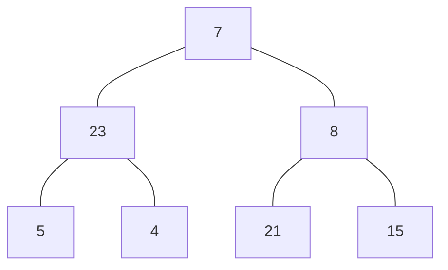

It's a hierarchical data structure. Used to represent things like organizational hierarchy, the file system directory
structure, or database indexes.

- **Nodes**: Element of a tree.
- **Edge**: The path connecting two nodes.
- **Leaf node**: A node that doesn't have any children.
- **Root node**: First node in the tree.
- **Parent nodes**: Node above any other node.
- **Height**: Maximum number of edges from the root to a leaf node.
- **Branching factor**: The amount of children a tree has.

## Types of trees

- **Binary tree**
  - A tree where the maximum number of children a node can have is 2.
- **Balanced tree**
  - A tree is _perfectly_ balanced when any nodes' left and right children have the same height.
- **Binary search tree**
  - A type of binary tree with sorted nodes.
  - The value in the left node is smaller than the value in the parent.
  - The value in the right node is greater than the value in the parent.

## Traversals

### Depth-first

We use a [stack](stack). Easier to implement with recursion. It preserves the shape of the tree.

#### Pre-order

- Root at the beginning.
- **Visit node**, recurse left, recurse right.
- **7**, 23, 5, 4, 3, 18, 21

#### In-order

- Root at the middle.
- Recurse left, **visit node**, recurse right.
- 5, 23, 4, **7**, 18, 3, 21

#### Post-order

- Root at the end.
- Recurse left, recurse right, **visit node**.
- 5, 4 23, 18, 21, 3, **7**

### Breadth-first

We use a [queue](queue). It does NOT preserve the shape of the tree.

Given the previous tree, we would traverse in the following order: 7, 23, 8, 5, 4, 21, 15
